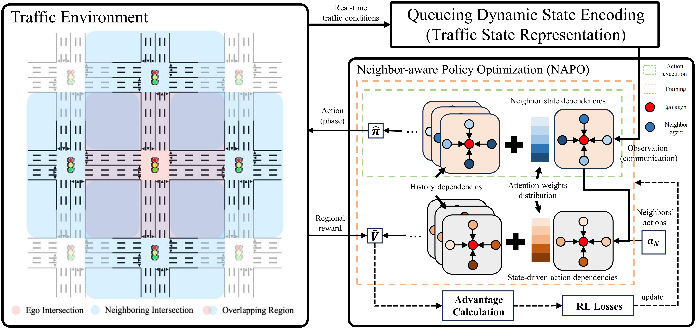

# CoordLight: Learning Decentralized Coordination for Network-Wide Traffic Signal Control
This repository is the official implementation of **CoordLight: Learning Decentralized Coordination for Network-Wide Traffic Signal Control**, 
accepted in **IEEE Intelligent Transportation Systems (T-ITS)** 2025. 




## Requirements
All necessary requirements are detailed in the requirements.txt file.
The important library dependencies include:
```
cityflow=0.1
ray=2.3.1
gym=0.26.2
scipy=1.10
torch==1.8.1
einops=0.6.0
```

Note: PyTorch 1.8.1 and CUDA 11.1 are used by default and different PyTorch versions may impact performance.

Create a new virtual conda environment using the requirements.txt file:
```
conda create --name CoordLight --file requirements.txt
```

Furthermore, install the traffic simulator - CityFlow by following the instructions outlined in https://cityflow.readthedocs.io/en/latest/start.html.

If the error `'GLIBCXX_3.4.30' not found` occurs during runtime, refer to the following solution:
[GLIBCXX_3.4.30 not found for librosa in conda environment](https://stackoverflow.com/questions/72540359/glibcxx-3-4-30-not-found-for-librosa-in-conda-virtual-environment-after-tryin).

## Files
- Driver.py: Training codes, maintain & update network parameters
- Runner.py: Training codes, collect trajectories via interactions  
- Tester.py: Testing codes for trained models
- Parameters.py: Training parameters & Experiment parameters
- /MATSC_gym: Gym environment codes for simulation experiments
- /Models: Codes defining the neural network structures
- /Network: CityFlow datasets for simulation experiments

[//]: # (- /TrainedModels: Trained models for different CityFlow datasets)

## Train
Configure training, environment, and simulation parameters in Parameters.py, 
**particularly those in INPUT_PARAMS and EXPERIMENT_NAME in EXPERIMENT_PARAMS**. For example:
- `MAX_EPISODES` sets the number of training episodes. The recommended values are 25000 for DJ and DH datasets, 
and 3000 for the DN dataset. 
- `NUM_META_AGENTS` specifies the number of processes used for multiprocess training.
Recommended values: 4 for DJ and DH datasets, 1 for DN dataset.
- `CITYFLOW_OBS_TYPE` defines the state used for both training and testing. Available options: `QDSE` (ours), `VC`, `GP`, `EP`, `ATS`, and `DTSE`.
- `CITYFLOW_NEI_R_TYPE` specifies the reward used during training: `REGION` for regional coordination rewards
and `NEIGHBOR` for neighbor cooperation rewards.
- `CITYFLOW_MAP_TYPE` and `CITYFLOW_FLOW_TYPE` define the map type and traffic demand type for both training and testing.
- `EVAL_TRAFFIC` controls whether traffic evaluation metrics are recorded in TensorBoard during training process.
- `LOAD_MODEL` and `MODEL_PATH` specify whether to resume training from a checkpoint and the path to the saved model.


Subsequently, use the following command to initiate model training:
```
python Driver.py
```

## Test
Modify the parameters in Tester.py to execute a specific test scenario (3 demands for Jinan map, 2 demands for Hangzhou map, and 2 demands for New York map). 
Ensure that users set the identical configuration for the type of CityFlow map and traffic demand in Parameter.py. 
It is important to specify `TEST_PATH` and `EXPERIMENT_NAME` in Tester.py, ensuring they match the `BASE_PATH` and `EXPERIMENT_NAME` used during training.
Once configured, execute the following command to evaluate the trained model:
```
python Tester.py
```

After testing, the results can be found in the `/TEST_PATH/EXPERIMENT_NAME/` directory.


## Citation
If you find this code useful in your research, please consider citing our paper:
```
@article{zhang2025coordlight,
  title={Coordlight: Learning decentralized coordination for network-wide traffic signal control},
  author={Zhang, Yifeng and Goel, Harsh and Li, Peizhuo and Damani, Mehul and Chinchali, Sandeep and Sartoretti, Guillaume},
  journal={IEEE Transactions on Intelligent Transportation Systems},
  year={2025},
  publisher={IEEE}
}
```
